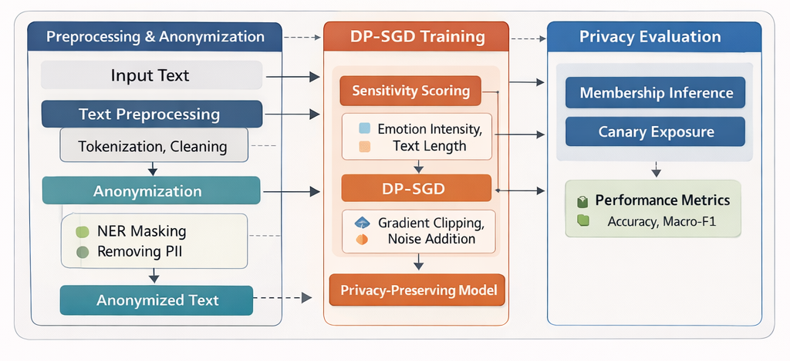
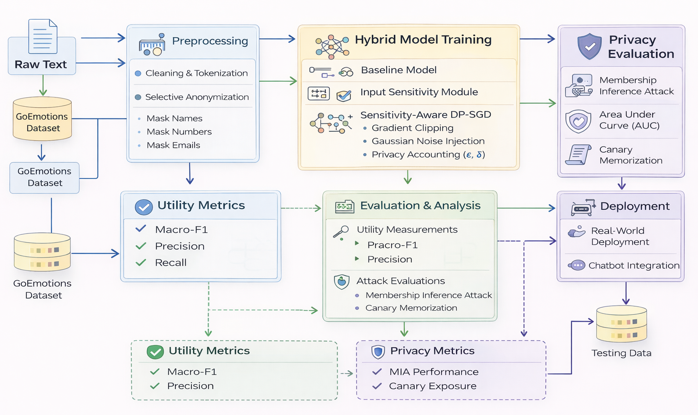
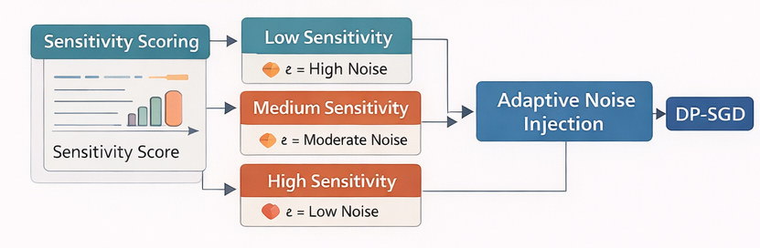

# Hybrid Differential Privacy Framework for Protecting Sensitive Text Data in NLP

## Overview

This repository contains the implementation of a **Hybrid Differential Privacy (DP) framework** designed to protect sensitive textual data in Natural Language Processing (NLP) applications.

The framework integrates:
- **Selective anonymization (input-level protection)**
- **Sensitivity-aware Differentially Private SGD (training-time protection)**

The goal is to achieve a **balanced trade-off between privacy and model utility**, particularly in high-risk domains such as **mental health conversational AI**.


## Research Motivation

Modern NLP models are vulnerable to:
- Membership Inference Attacks (MIA)
- Memorization of sensitive training data
- Leakage of Personally Identifiable Information (PII)

Existing approaches:
- Anonymization → weak guarantees
- Differential Privacy → strong guarantees but utility loss

👉 This project combines both to overcome these limitations.


## Key Contributions

- Hybrid privacy framework (Anonymization + DP-SGD)
- Sensitivity-aware noise allocation mechanism
- Unified experimental comparison (V0–V3 models)
- Attack-based privacy evaluation (MIA + memorization)
- End-to-end chatbot deployment validation


## System Architecture

The pipeline consists of:

1. **Data Preprocessing**
   - Cleaning and normalization
   - Multi-label emotion dataset (GoEmotions)

2. **Selective Anonymization**
   - Masking URLs, numbers, and sensitive patterns

3. **Sensitivity Scoring**
   - Based on emotion intensity and text length

4. **DP-SGD Training**
   - Gradient clipping
   - Gaussian noise injection
   - Privacy accounting (ε, δ)

5. **Sensitivity-Aware Mechanism**
   - Adaptive noise allocation per sample

6. **Evaluation**
   - Utility: Macro-F1, Precision, Recall
   - Privacy: MIA, memorization, canary exposure


The proposed hybrid framework integrates preprocessing, adaptive privacy mechanisms, and evaluation in a unified pipeline.



## Research Pipeline

The complete experimental workflow from raw text to privacy evaluation is shown below.



## Sensitivity-Aware Privacy Mechanism

The framework dynamically adjusts noise based on input sensitivity.




## Model Variants

| Model | Description |
|------|------------|
| V0 | Baseline (no privacy) |
| V1 | Anonymization only |
| V2 | Uniform DP-SGD |
| V3 | Hybrid (Proposed) |

---

## Key Results

- **Memorization reduced to 0%** (DP models)
- **Hybrid model retains ~79.5% utility**
- **MIA performance reduced to near-random**
- Improved privacy–utility balance vs baselines

---

## Installation

```bash
git clone https://github.com/your-username/hybrid-dp-nlp-privacy.git
cd hybrid-dp-nlp-privacy
pip install -r requirements.txt
